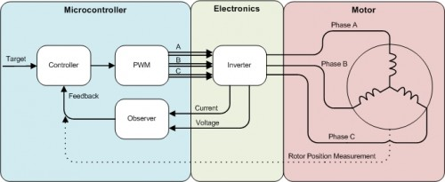
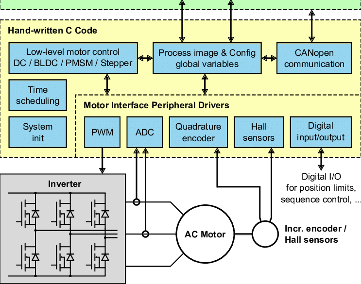

[Difference Between Microprocessor and Microcontroller](https://www.naukri.com/learning/articles/difference-between-microprocessor-and-microcontroller/)

[back-EMF(Back ElectroMotive Force) 역기전력: 전류 변화를 방해하는 유도 전압](https://gammabeta.tistory.com/2809)

[BLDC vs PMSM](https://sharehobby.tistory.com/entry/BLDC-vs-PMSM)  
BLDC(Brushless Direct Current Motor)  
PMSM(Permanent Magnet Synchronous Motor)

[Motor Control Part1: Introduction to BLDC motors](https://www.youtube.com/watch?v=gNpoTPzEkco)  

# Roles and Responsibilities:  
•	Develop highly reliable software systems  
> what is reliable software systems  

•	Develop motor controller firmware architecture  
> I think that motor controller firmware architecture would have some interfaces with PWM(Pulse Width Modulation) and Sensor detector.  
  
 [major components of the BLDC control system](https://openecu.com/bldc-control-architecture-part-one/)  
  
  
[Advanced Motor Controller (AMC) system architecture.](https://www.researchgate.net/figure/Advanced-Motor-Controller-AMC-system-architecture_fig4_304665664)

•	Board bring-up of next-generation motor controllers  
•	Write interface code for sensors and digital communication  
•	Develop prototypes to prove out key design concepts and quantify technical constraints  
•	Write high quality structured bare metal software for embedded processors (e.g. ARM, PowerPC, x86)  
•	Design embedded software to meet requirements including [verification](https://www.modernanalyst.com/Careers/InterviewQuestions/tabid/128/ID/1168/What-are-the-four-fundamental-methods-of-requirement-verification.aspx) and [traceability](https://www.perforce.com/blog/alm/what-traceability)  
•	Work with power electronics, motor design, and electromechanical engineers to develop motor control systems  

## Required Qualifications:
•	Bachelor's degree in Computer Science, Electrical Engineering, or related field and 4+ years of experience in systems-level C (kernels, device drivers, hypervisors)  
•	Extensive experience and mastery of C and/or C++ programming  
•	Knowledge and experience with real-time software  
•	Knowledge of and experience with communication protocols including I2C, CAN, [SPI](https://en.wikipedia.org/wiki/Serial_Peripheral_Interface), UART, etc.  
[I2C란?](https://mickael-k.tistory.com/184)  
> I2C, 아이 투 씨 라고 주로 하지만 사실 정식 명칭은 '아이 스퀘어 씨' 이다.  
Inter-Integrated Circuit(I2C)는 IC 사이 통신 링크를 제공하는 양방향 2와이어 직렬 버스 이다. 즉, 두가닥으로 직렬 통신을 하는 통신프로토콜 이다.  
  
[BASICS OF THE I2C COMMUNICATION PROTOCOL](https://www.circuitbasics.com/basics-of-the-i2c-communication-protocol/)

•	Extensive understanding of embedded software principles and ability to conduct code reviews  
•	Hands on experience with building and debugging hardware/firmware systems  
•	Strong skills in debugging, performance optimization and unit testing  
•	Creative approach to problem solving and exceptional analytical skills  
## Desired Qualifications:
•	Experience with DO-178 and DO-254 or similar automotive standards  
•	Knowledge of permanent magnet brushless motor control  
•	Fluency in Python and other scripting languages  
•	Prior experience in real time products that required high reliability and fault tolerance  
•	Hands-on experience using test and measurement equipment such as oscilloscopes, logic analyzers, voltmeters  

